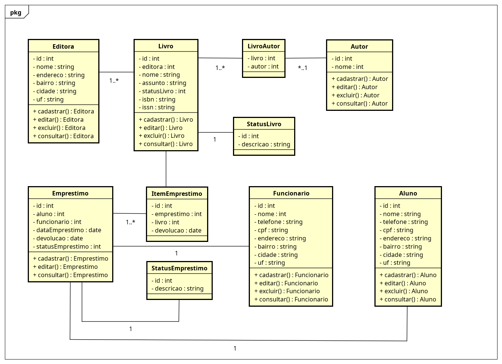

# Lista de Exercícios 02 - LPOO

### 01 - Imagine o sistema da biblioteca da Faculdade. Podemos modelar e implementar um sistema para ela? Sim. Faça isso usando os conhecimentos de OO. Faça o desenho no Astah ou em algum outro software de desenho. Inclua as informações de cardinalidade. Inclua pelo menos 5 classes.



### 02 -  Implemente uma classe chamada Carro com as seguintes propriedades:

* Um veículo tem um certo consumo de combustível (medidos em km / litro) e uma certa quantidade
de combustível no tanque;
* O consumo é especificado no construtor e o nível de combustível inicial é 0;
* Forneça um método andar() que simule o ato de dirigir o veículo por uma certa distância,
reduzindo o nível de combustível no tanque de gasolina;
* Forneça um método obterGasolina(), que retorna o nível atual de combustível;
* Forneça um método adicionarGasolina(), para abastecer o tanque. Exemplo de uso:
    - meuFusca = Carro(15); # 15 quilômetros por litro de combustível.
    - meuFusca.adicionarGasolina(20); # abastece com 20 litros de combustível.
    - meuFusca.andar(100); # anda 100 quilômetros.
    - meuFusca.obterGasolina(). # Imprime o combustível que resta no Tanque.

```py
class Carro:
    consumo: 0
    quantidade_combustivel: 0
    
    def __init__(self, consumo):
        self.consumo = consumo
        self.quantidade_combustivel = 0
    
    def andar(self, km):
        if self.quantidade_combustivel * self.consumo < km:
            print("Não é possível andar essa distância. Não há combustível suficiente.")
        else:
            self.quantidade_combustivel -= km / self.consumo
        
    def adicionar_gasolina(self, litros):
        self.quantidade_combustivel += litros
        
    def obter_gasolina(self):
        print (f"O carro tem {self.quantidade_combustivel:.2f} litros de combustível.")
```

```py
from carro import Carro

meu_fusca = Carro(15)
meu_fusca.adicionar_gasolina(20)
meu_fusca.andar(100)
meu_fusca.obter_gasolina()
```